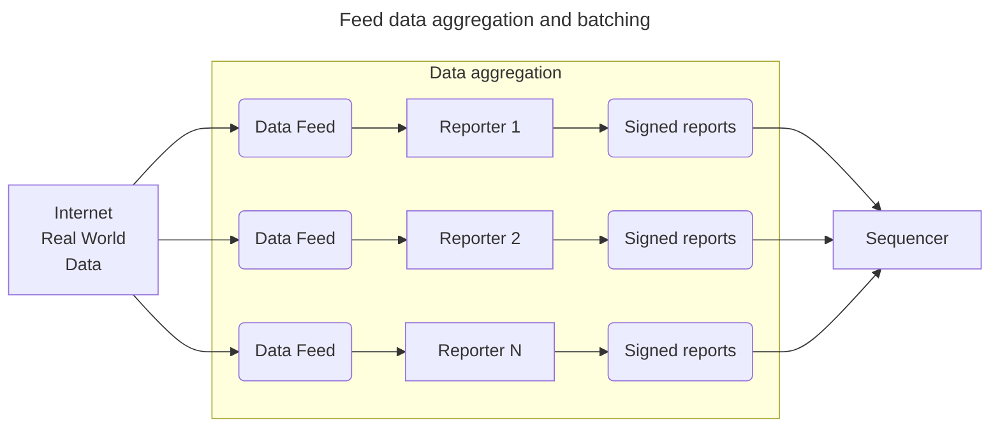
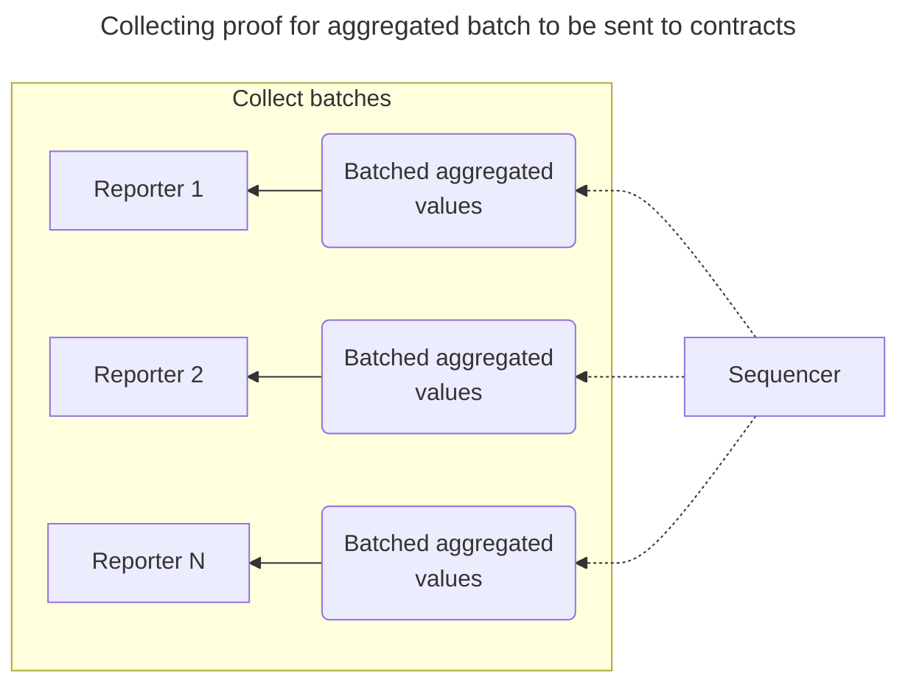
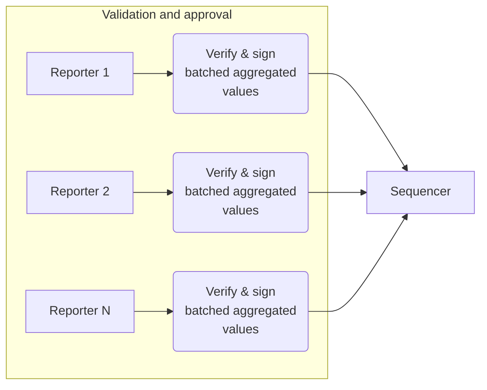
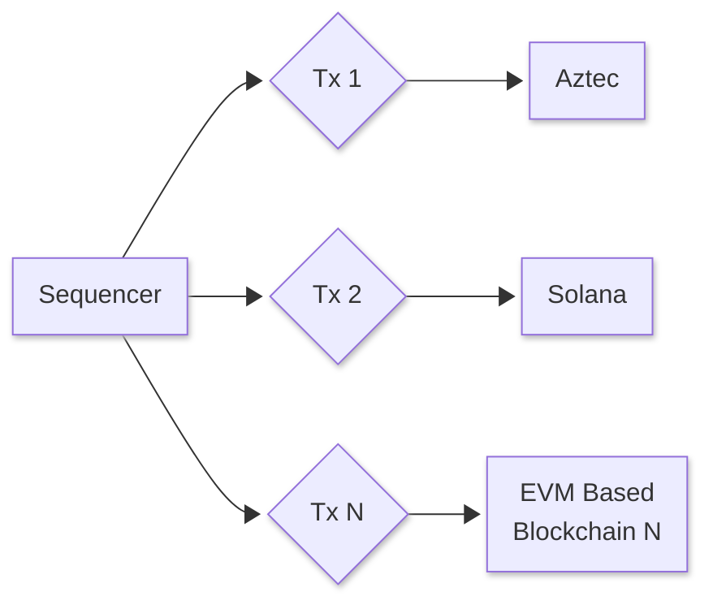

import { DiagramImageWrapper } from "@/components/common/DiagramImageWrapper";

# Blocksense Architecture
<DiagramImageWrapper
  className="mt-3 dark:hidden"
  src="/diagrams/BlocksenseArchitecture.png"
  alt="Blocksense Architecture"
/>
<DiagramImageWrapper
  className="mt-3 hidden dark:block"
  src="/diagrams/dark/BlocksenseArchitectureDark.png"
  alt="Blocksense Architecture"
/>

## How Does Blocksense Work?

### 1. Data Feed Collection

- **Internet Real World Data**: Sources from the internet, such as APIs, websites, and other data services, provide raw data for processing.
- **Reporters**: Nodes in the Blocksense network fetch, process, and report data from these sources. Multiple reporters work in parallel to ensure redundancy and reliability. They execute predefined scripts or algorithms to process collected data and package it into a report.

Description for the above diagram: The reporters collect latest values for different feeds from various sources and send their signed votes for those feeds to the sequencer

### 2. Reporting and Aggregation

- **Reporters**: Publish the obtained value to a sequencer and are rewarded.
- **Sequencer**: Aggregates reports from multiple reporters and produces a batch of values to be posted to the contracts in multiple supported networks based on a quorum of reports. Propose to the reporters the batch + proof for the performed aggregation for second round of consensus.
- **Reporters**: Validate and potentially approve the batch to be posted to supported networks by participating in signature share (second round of consensus).

Description of the above diagram: The Sequencer collects a quorum of the above reported values per feed, aggregates them and batches the aggregated values for multiple feeds. Once this process is complete, the Sequencer sends the batch of aggregated values + the signed votes that were used to reach each aggregated value in the batch to the reporters for them to validate and approve by sending to the sequencer a sign of the batch.

### 3. Sequencing and Validation

- **Creating Transactions**: Validated reports are aggregated and packaged into transactions ready for publication on the target blockchains.
- **Sequencer**: Collects the confirmations (signature shares) from reporters and sends the approved updates to a Gnosis Safe contract in each supported network. The safe contract validates the signature shares and then forwards the updates of feed data to the ADFS contract.

Description: As mentioned above, each Reporter validates that aggregated batch that the Sequencer produced and if all checks pass returns a signature. A quorum of such signatures from reporters enable the Sequencer to post the feed value updates batch to the supported blockchain networks.

### 4. Send verified and signed batched aggregated values to all chains

- **Sequencer**: Propagating verifiable data to supported chains

Description: Once the sequencer collects a quorum of signatures for the aggregated batch it sends it to the supported blockchain networks.

## Ensuring Timely Updates

- **Assignment**: In the Blocksense node software, feeds are assigned to ensure timely updates. While the specific feeds change, the roles of reporters and sequencers remain fixed. This committee of reporters and sequencers handles different feeds without altering their roles, securing consistent and efficient data feed management.
- **Reporters**: Are given a fixed time slot in which they must compute the required values and send them to the Aggregator to avoid slashing.
- **Aggregators**: Package updates into bundles for re-broadcasting.
- **Block Builders**: Combine bundles into final blocks for publication.

## Creating New Data Feeds

New data feeds can be written easily using the **Blocksense SDK**. Oracle scripts can be bootstrapped with initial funds and become self-sufficient through on-chain data access fees. The protocol supports various types of oracles, from simple URL contents to complex GPU scripts for ML inference.
