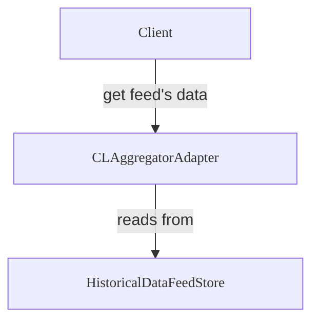

import { Callout } from "@blocksense/ui/Callout";

# Chainlink Proxy

The Chainlink Proxy is a smart contract that acts as a proxy for a Blocksense feed. It provides easy access to the latest round data and historical round data for a given feed. The Chainlink Proxy is responsible for a single feed associated with a specific token pair on a given network. It exposes a part of Chainlink's aggregator interface, hence the name.

<Callout type="info" emoji="💡">
  Feeds without a corresponding token address, such as those for stock indices,
  do not have a dedicated Chainlink Proxy due to the lack of a canonical token
  representation.
</Callout>

For a complete list of functions and parameters for the CLAggregatorAdapter contract, see the [Chainlink Proxy Reference Documentation](../../reference-documentation/CLAggregatorAdapter.mdx).



For a complete list of functions and parameters for the CLAggregatorAdapter contract, see the [Chainlink Proxy Reference Documentation](../../reference-documentation/CLAggregatorAdapter.mdx).

## Code Examples

### Solidity

To consume price data from the Chainlink Proxy, your smart contract should reference [`ICLAggregatorAdapter`](/coming-soon), which defines the external functions implemented by the Chainlink Proxy.

```solidity showLineNumbers copy filename="ChainlinkProxyConsumer.sol"
// SPDX-License-Identifier: MIT
pragma solidity ^0.8.24;
/**
 * THIS IS AN EXAMPLE CONTRACT THAT USES HARDCODED VALUES FOR CLARITY.
 * THIS IS AN EXAMPLE CONTRACT THAT USES UN-AUDITED CODE.
 * DO NOT USE THIS CODE IN PRODUCTION.
 */
contract ChainlinkProxyConsumer {
  IChainlinkAggregator public immutable feed;

  constructor(address feedAddress) {
    feed = IChainlinkAggregator(feedAddress);
  }

  function getLatestAnswer() external view returns (uint256) {
    return uint256(feed.latestAnswer());
  }

  function getLatestRoundData()
    external
    view
    returns (
      uint80 roundId,
      int256 answer,
      uint256 startedAt,
      uint256 updatedAt,
      uint80 answeredInRound
    )
  {
    return feed.latestRoundData();
  }
}
```

### Solidity Hardhat Example

<Callout type="info" emoji="💡">
You can find a working Hardhat project [here](/coming-soon). Clone the repo
and follow the setup instructions to run the example locally.
</Callout>

### Ethers.js v6.x

To get latest price:

```js copy filename="javascript"
const aggregator = new ethers.Contract(contractAddress, abiJson, provider);
const price = await aggregator.latestAnswer();
```

To get round data:

```js copy filename="javascript"
const aggregator = new ethers.Contract(contractAddress, abiJson, provider);
const [roundID, answer, startedAt, updatedAt, answeredInRound] =
  await aggregator.getRoundData(roundId);
```

To get the feed key the Chainlink Proxy is responsible for:

```js copy filename="javascript"
const aggregator = new ethers.Contract(contractAddress, abiJson, provider);
const key = await aggregator.key();
```
