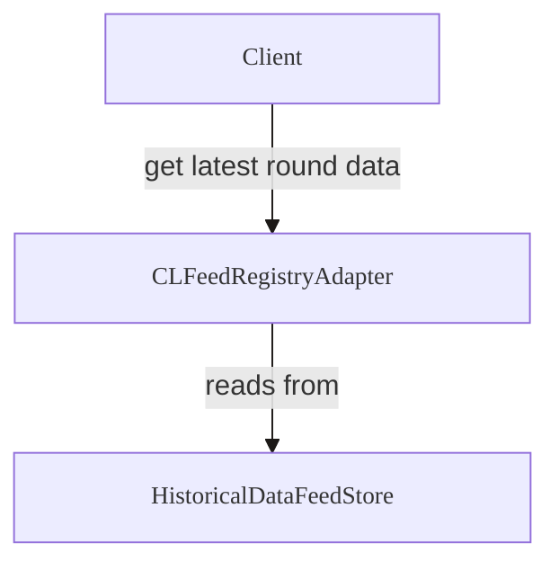

import { Callout } from "@blocksense/ui/Callout";

# Feed Registry

The Feed Registry serves as a blockchain-based directory that links assets to their corresponding data feeds. This system allows for direct querying of Blocksense data feeds using asset addresses, eliminating the need-to-know specific feed contract addresses. As a result, smart contracts can efficiently retrieve up-to-date asset prices through a single function call to a unified contract interface.

<Callout type="info" emoji="💡">
  The Feed Registry exclusively includes feeds associated with canonical token
  addresses on a given network. Feeds without a corresponding token address,
  such as those for stock indices, are not included in the registry due to the
  lack of a canonical token representation.
</Callout>

For a complete list of functions and parameters for the CLFeedRegistryAdapter contract, see the [Feed Registry Reference Documentation](../../reference-documentation/CLFeedRegistryAdapter.mdx).



<Callout type="info" emoji="💡">
  The Feed Registry exclusively includes feeds associated with canonical token
  addresses on a given network. Feeds without a corresponding token address,
  such as those for stock indices, are not included in the registry due to the
  lack of a canonical token representation.
</Callout>

For a complete list of functions and parameters for the CLFeedRegistryAdapter contract, see the [Feed Registry Reference Documentation](../../reference-documentation/CLFeedRegistryAdapter.mdx).

## Base and Quote

The Feed Registry maps feeds from `base` and `quote` address pairs. To get the latest WETH / USDC round data from the registry, call:

```solidity copy filename="solidity"
latestRoundData(address base, address quote)
```

For example, to get the latest WETH / USDC price:

- `base`: The WETH token address on that network e.g. `0xC02aaA39b223FE8D0A0e5C4F27eAD9083C756Cc2` for WETH on Ethereum mainnet
- `quote`: The USDC token address on Ethereum mainnet `0xA0b86991c6218b36c1d19D4a2e9Eb0cE3606eB48`

```solidity copy filename="solidity"
latestRoundData(0xC02aaA39b223FE8D0A0e5C4F27eAD9083C756Cc2, 0xA0b86991c6218b36c1d19D4a2e9Eb0cE3606eB48)
```

## Code Examples

### Solidity

To consume price data from the Feed Registry, your smart contract should reference [`ICLFeedRegistryAdapter`](/coming-soon), which defines the external functions implemented by the Feed Registry.

```solidity showLineNumbers copy filename="RegistryConsumer.sol"
// SPDX-License-Identifier: MIT
pragma solidity ^0.8.24;

import 'interfaces/ICLFeedRegistryAdapter.sol';

/**
 * THIS IS AN EXAMPLE CONTRACT THAT USES HARDCODED VALUES FOR CLARITY.
 * THIS IS AN EXAMPLE CONTRACT THAT USES UN-AUDITED CODE.
 * DO NOT USE THIS CODE IN PRODUCTION.
 */
contract RegistryConsumer {
  ICLFeedRegistryAdapter public immutable registry;

  constructor(address _registry) {
    registry = ICLFeedRegistryAdapter(_registry);
  }

  function getDecimals(
    address base,
    address quote
  ) external view returns (uint8 decimals) {
    return registry.decimals(base, quote);
  }

  function getDescription(
    address base,
    address quote
  ) external view returns (string memory description) {
    return registry.description(base, quote);
  }

  function getLatestAnswer(
    address base,
    address quote
  ) external view returns (uint256 asnwer) {
    return uint256(registry.latestAnswer(base, quote));
  }

  function getLatestRound(
    address base,
    address quote
  ) external view returns (uint256 roundId) {
    return registry.latestRound(base, quote);
  }

  function getRoundData(
    address base,
    address quote,
    uint80 roundId
  )
    external
    view
    returns (
      uint80 roundId_,
      int256 answer,
      uint256 startedAt,
      uint256 updatedAt,
      uint80 answeredInRound
    )
  {
    return registry.getRoundData(base, quote, roundId);
  }

  function getLatestRoundData(
    address base,
    address quote
  )
    external
    view
    returns (
      uint80 roundId,
      int256 answer,
      uint256 startedAt,
      uint256 updatedAt,
      uint80 answeredInRound
    )
  {
    return registry.latestRoundData(base, quote);
  }

  function getFeed(
    address base,
    address quote
  ) external view returns (IChainlinkAggregator feed) {
    return registry.getFeed(base, quote);
  }
}
```

### Solidity Hardhat Example

<Callout type="info" emoji="💡">
  You can find a working Hardhat project [here](/coming-soon). Clone the repo
  and follow the setup instructions to run the example locally.
</Callout>

### Ethers.js v6.x

To get latest price:

```js copy filename="javascript"
const registry = new ethers.Contract(contractAddress, abiJson, provider);
const price = await registry.latestAnswer(base, quote);
```

To get round data:

```js copy filename="javascript"
const registry = new ethers.Contract(contractAddress, abiJson, provider);
const [roundID, answer, startedAt, updatedAt, answeredInRound] =
  await registry.getRoundData(base, quote, roundId);
```

To get the CLAggregatorAdapter address responsible for a given feed:

```js copy filename="javascript"
const registry = new ethers.Contract(contractAddress, abiJson, provider);
const chainlinkProxyAddress = await registry.getFeed(base, quote);
```
