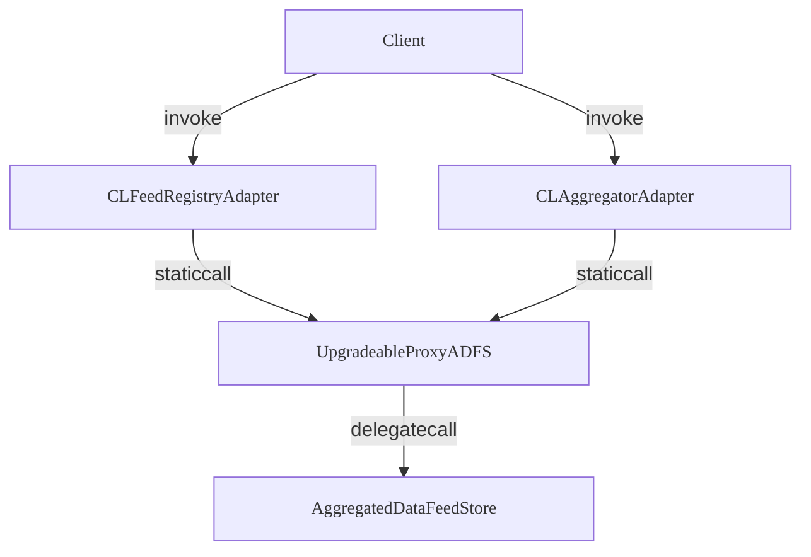

import contractsFileStructure from "@blocksense/contracts/contractsFileStructure.json";
import { ContractsFileTree } from "@/sol-contracts-components/ContractsFileTree";
import { Callout } from "nextra/components";

# Introduction

This document provides a quick-start guide to smart contracts as part of our Blocksense protocol. You can explore the structure and functionality of these contracts and unlock a deeper understanding of our cutting-edge data feed storage mechanism.

## Folder Structure

Smart `contracts` for Blocksense network are stored inside our public GitHub repository. The contracts folder is organized as presented below:

<ContractsFileTree data={contractsFileStructure} />

## Smart Contracts Architecture

This diagram illustrates the role of smart contracts in ensuring data integrity and enabling trustless interactions. Blocksense leverages a protocol where clients interact with smart contracts deployed on the blockchain. These contracts utilize proxy patterns to allow seamless upgrade ability and employ historical data feeds for transparent data sourcing and verification.



### Components Overview

- **Client**: Represents users and external systems interacting with Blocksense protocol.

- **CLFeedRegistryAdapter**: Represents an on-chain mapping of assets, base or quote pairs, to their corresponding feeds. It provides users and clients with Chainlink interface functions to query feed data using asset addresses, eliminating the need-to-know specific feed contract address.

- **UpgradeableProxyADFS**: Proxy contracts designed to simplify upgrades of smart contract logic without disrupting storage layout. This ensures scalability and adaptability of the Blocksense platform over time.

- **AggregatedDataFeedStore**: Secure repository for storing historical data feeds. It provides past record data inputs, enhancing audibility and traceability within the Blocksense network.

- **CLAggregatorAdapter**: Proxy instance, that allows users and clients to retrieve data for a specific feed through Chainlink interface methods.

### Functional Significance

Each component plays an important role in maintaining the integrity and operational efficiency of Blocksense decentralized application infrastructure. Smart contracts automate and enforce agreements, ensuring that transactions are executed according to predefined rules without the need for intermediaries. This approach not only enhances transparency and trust but also reduces costs and eliminates single points of failure traditionally associated with centralized systems.

## Core contracts

### AggregatedDataFeedStore (ADFS)

This contract stores historical data feed values of different strides, allowing users to retrieve past data points for specific data feed IDs.

<Callout type="warning" emoji="⚠️">
  In practice, the UpgradeableProxyADFS contract is the central storage for all data. The AggregatedDataFeedStore contract provides the logic for reading from and writing to the UpgradeableProxyADFS contract’s storage.
</Callout>

**EVM knowledge prerequisites:**
- Storage is represented as chunks of 32 bytes called slots. Each chunk has an address.
- Addresses are 20 bytes long data represented in hex.
- You can access all storage directly by using an address, without allocating memory first.
- Storing data is paid per the number of slots we write to.

Data feeds in this contract are of different slot sizes based on the stride (powers of 2). For example, stride 0 is 32b (1 slot) data, stride 1 is 64b, stride 2 is 128b and so on. Data feeds have historical data stored up to 8192 rounds. CL-compatible contracts make use of only stride 0 data feeds.

In the image below each box represents a slot (32b) where round (historical) data can be stored for a feed. Each feed has 2\*\*13 rounds and in a single stride, there are 2\*\*115 feed IDs. There are 32 strides.

```
          ┌───────────────────────────────┐
          │          stride 0 (32b)       │
          │───────────────────────────────│
          ├───┌───┌───┌───┌───┌───┌───┌───┤
feed id 0 │   │   │   │   │   │   │   │   │
          ├───└───└───└───└───└───└───└───┤
          │                               │
          │   ...... 2**13 rounds ......  │
          │                               │
          ├───┌───┌───┌───┌───┌───┌───┌───┤
feed id 1 │   │   │   │   │   │   │   │   │
          ├───└───└───└───└───└───└───└───┤
        . │                               │
        . │   ...... 2**13 rounds ......  │
          │                               │
feed id N └───────────────────────────────┘
```

Storage representation for a greater stride (128b - 4 slots):

```
          ┌───────────────────────────────┐
          │        stride 2 (128b)        │
          │───────────────────────────────│
          ├───────────────┌───────────────┤
feed id 0 │   │   │   │   │   │   │   │   │
          ├───────────────└───────────────┤
          │                               │
          │   ...... 2**13 rounds ......  │
          │                               │
          ├───────────────┌───────────────┤
feed id 1 │   │   │   │   │   │   │   │   │
          ├───────────────└───────────────┤
        . │                               │
        . │   ...... 2**13 rounds ......  │
          │                               │
feed id N └───────────────────────────────┘
```

When storing historical data, we also need to store the latest round. This is achieved in a separate space in the storage - the Round Table:

```
                    ┌───────────────────────────────────────┐
                    │           latest round table          │
                    │───────────────────────────────────────┤
                    ├───┌───┌───┌───┌───┌───┌───┌───┌───┌───┤slot 0
      feed id  0-15 │2b │2b │2b │ . │ . │ . │ . │2b │2b │2b │
                    ├───└───└───└───└───└───└───└───└───└───┤ 32b
                    │ 0   1   2   .   .   .   .  13  14  15 │
                    │                                       │
                    │                                       │
                    │             .............             │
                    │                                       │
                    ├───┌───┌───┌───┌───┌───┌───┌───┌───┌───┤slot 312
  feed id 4992-5008 │2b │2b │2b │ . │ . │ . │ . │2b │2b │2b │
                    ├───└───└───└───└───└───└───└───└───└───┤ 32b
                    │                                       │
                    └───────────────────────────────────────┘

                    max id: (2**115)*32        max slot: 2**116
```

In the Round Table, each slot contains 16 chunks where the latest round for a feed ID is stored. This way we achieve less frequent writing to the storage hence paying less gas.

#### Optimised writing

Keeping in mind the Round table above, when writing to the contract it will be less costly if data feeds of the same stride with IDs between `id%16 == 0` and `id%16 == 15` are packed together in a transaction due to single latest counter update.

#### Subscribe to update events

When an update is posted to the contract, an event is emitted - “DataFeedsUpdated(uint256 blockNumber)” (topic: `0xe64378c8d8a289137204264780c7669f3860a703795c6f0574d925d473a4a2a7`). Block number is an internal counter for the Blocksense system. Through this event off-chain programs can subscribe to updates and trigger on-chain actions when needed.

#### Read from storage

See the [Integration guide](./integration-guide/using-data-feeds/aggregated-data-feed-store) for more information.

Limitations: one can read a whole feed, i.e. all of its historical data, but cannot read more than one feed in a call. If a feed is of a greater stride (anything but stride 0), one can pass start slot and slots count (optional) parameters to read a specific data slice. For example, we have a data feed of stride 5 (i.e. 1024b or 32 slots) and we want to read only the last 3 slots, we would pass 29 (counting starts from 0) as start slot and 3 as slots count.

### Access Control

This contract is called when writing to the ADFS storage. Its role is to check if the writer (caller of the transaction) has permission to write to the storage; if not - reverts the transaction.

### CL Adapters

  The `cl-adapters` folder contains Chainlink aggregator adapter contract (`CLAggregatorAdapter.sol`) and a feed registry contract (`/registries/CLFeedRegistryAdapter.sol`). The CL aggregator adapter contract implements the Chainlink aggregator interface, enabling it to interact with the `UpgradeableProxyADFS` contract to fetch stored data. The idea is that the `UpgradeableProxyADFS` holds the storage in itself and only uses the `AggegatedDataFeedStore` contract functions to know how to read or write to its own storage.

### Interfaces

The `interfaces` folder includes the following key interfaces:

- `ICLAggregatorAdapter.sol`: Extends the functionality of `IChainlinkAggregator.sol`.
- `/chainlink/IChainlinkAggregator.sol`: Defines the interface for the Chainlink aggregator contract.
- `ICLFeedRegistryAdapter.sol`: Extends the functionality of `IChainlinkFeedRegistry.sol`.
- `/chainlink/IChainlinkFeedRegistry.sol`: Defines the data feed registry contract interface.

### Libraries

The `libraries` folder contains `CLAdapterLib.sol` - used as an internal library in `CLFeedRegistryAdapter`, `CLAggregatorAdapter`, and some of the test consumer contracts to call `UpgradeableProxyADFS`, and `Blocksense.sol` - used by the example contracts. Both provide utilities for low-level static calls to the mentioned contracts to ensure maximum gas optimizations. Moreover, `CLAdapterLib` enables historical data parsing handlers to decode raw data from the storage, whereas `Blocksense` is designed for client contracts as a low-gas call library.

## Test Contracts

**`test` folder:**
- This folder includes example consumer contracts and reference implementations primarily for gas comparison purposes during testing. These examples provide a basis for evaluation of the gas efficiency.

**`experiments` folder:**
- There are 2 experiment folders - `/contracts/experiments` and `test/experiments`. Both contain code related to deprecated contracts that are kept only as reference and for gas comparison. They are not to be used anywhere in the system aside from testing.

## Prologue Optimization

### Overview

Prologue optimization aims to reduce gas costs associated with smart contract calls by skipping the Solidity dispatching prologue and instead using the selector as a data feed ID. This approach is intended to demonstrate potential cost savings compared to traditional methods like Chainlink.

### Call Handling Mechanism

All calls are managed by a fallback function based on the selector, ensuring efficient handling of setter and getter operations.

### Key Points

- A custom entry point, that bypasses the Solidity dispatching prologue.
- Selectors use reserved bits to decide which function they should call, and the rest of the bits tell them which data feed they're supposed to work with.
- The optimization reduces gas costs by eliminating the need for the Solidity compiler to generate "Linear If-Else Dispatcher" statements for different selectors.

### Benefits

- Reduced gas costs for smart contract calls.
