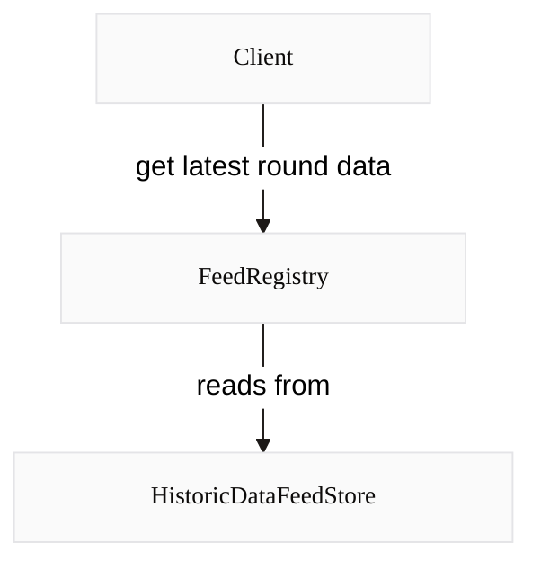

import { Callout } from '@blocksense/docs-theme';

# Feed Registry

The Feed Registry serves as a blockchain-based directory that links assets to their corresponding data feeds. This system allows for direct querying of Blockense data feeds using asset addresses, eliminating the need to know specific feed contract addresses. As a result, smart contracts can efficiently retrieve up-to-date asset prices through a single function call to a unified contract interface.



<Callout type="info" emoji="💡">
  The Feed Registry exclusively includes feeds associated with canonical token
  addresses on a given network. Feeds without a corresponding token address,
  such as those for stock indices, are not included in the registry due to the
  lack of a canonical token representation.
</Callout>

For a complete list of functions and parameters for the FeedRegistry contract, see the [Feed Registry Reference Documentation](../reference-documentation/FeedRegistry.mdx).

## Base and Quote

The Feed Registry maps feeds from `base` and `quote` address pairs. To get the latest WETH / USDC round data from the registry, call:

```solidity copy filename="solidity"
latestRoundData(address base, address quote)
```

For example, to get the latest WETH / USDC price:

- `base`: The WETH token address on that network e.g. `0xC02aaA39b223FE8D0A0e5C4F27eAD9083C756Cc2` for WETH on Ethereum mainnet
- `quote`: The USDC token address on Ethereum mainnet `0xA0b86991c6218b36c1d19D4a2e9Eb0cE3606eB48`

```solidity copy filename="solidity"
latestRoundData(0xC02aaA39b223FE8D0A0e5C4F27eAD9083C756Cc2, 0xA0b86991c6218b36c1d19D4a2e9Eb0cE3606eB48)
```

## Code Examples

### Solidity

To consume price data from the Feed Registry, your smart contract should reference [`IFeedRegistry`](/coming-soon), which defines the external functions implemented by the Feed Registry.

```solidity showLineNumbers copy filename="RegistryConsumer.sol"
// SPDX-License-Identifier: MIT
pragma solidity ^0.8.24;
/**
 * THIS IS AN EXAMPLE CONTRACT THAT USES HARDCODED VALUES FOR CLARITY.
 * THIS IS AN EXAMPLE CONTRACT THAT USES UN-AUDITED CODE.
 * DO NOT USE THIS CODE IN PRODUCTION.
 */
contract RegistryConsumer {
  IFeedRegistry public immutable registry;

  constructor(address _registry) {
    registry = IFeedRegistry(_registry);
  }

  function getLatestPrice(
    address base,
    address quote
  ) external view returns (uint256) {
    return uint256(registry.latestAnswer(base, quote));
  }

  function getRoundData(
    address base,
    address quote,
    uint80 roundId
  ) external view returns (int256 _price, uint256 _lastUpdate) {
    (/*uint80 _roundId*/, _price, /*uint startedAt*/, _lastUpdate, /*uint80 answeredInRound*/) = registry.getRoundData(base, quote, roundId);
  }
}
```

### Solidity Hardhat Example

<Callout type="info" emoji="💡">
  You can find a working Hardhat project [here](/coming-soon). Clone the repo
  and follow the setup instructions to run the example locally.
</Callout>

### Ethers.js v6.x

To get latest price:

```js copy filename="javascript"
const registry = new ethers.Contract(contractAddress, abiJson, provider);
const price = await registry.latestAnswer(base, quote);
```

To get round data:

```js copy filename="javascript"
const registry = new ethers.Contract(contractAddress, abiJson, provider);
const [roundID, answer, startedAt, updatedAt, answeredInRound] =
  await registry.getRoundData(base, quote, roundId);
```

To get the ChainlinkProxy address responsible for a given feed:

```js copy filename="javascript"
const registry = new ethers.Contract(contractAddress, abiJson, provider);
const chainlinkProxyAddress = await registry.getFeed(base, quote);
```
