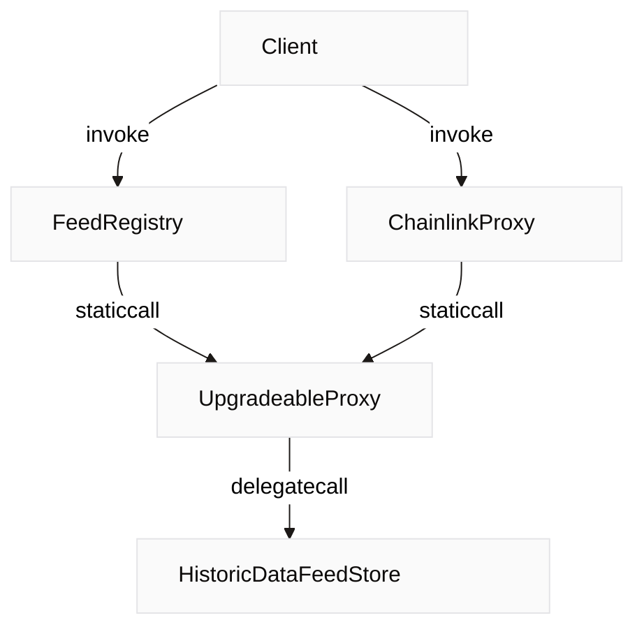

# Introduction

This document provides a quick-guide to smart contracts as part of our Blocksense protocol. You may explore the structure and functionality of these contracts, and unlock a deeper understanding of our cutting-edge data feed storage mechanism.

## Folder Structure

Smart `contracts` for Blocksense network are stored inside our public GitHub repository. The contracts folder is organized as presented below:

```code
📁 chainlink-proxies
│   📁 registries
│   │   └── FeedRegistry.sol
│   └── ChainlinkProxy.sol
📁 interfaces
│   ├── IAggregator.sol
│   ├── IChainlinkAggregator.sol
│   └── IFeedRegistry.sol
📁 libraries
│   └── ProxyCall.sol
📁 test
│   📁 consumers
│   │   📁 historic
│   │   │   └── ...
│   │   └── ...
│   📁 interfaces
│   │   └── ...
│   ├── DataFeedStoreGeneric.sol
│   ├── DataFeedStoreGenericV1.sol
│   ├── DataFeedStoreGenericV2.sol
│   └── HistoricDataFeedStoreGenericV1.sol
├── DataFeedStoreV1.sol
├── DataFeedStoreV2.sol
├── DataFeedStoreV3.sol
├── HistoricDataFeedStoreV1.sol
├── HistoricDataFeedStoreV2.sol
└── UpgradeableProxy.sol
```

## Smart Contract Architecture

This diagram illustrates the role of smart contracts in ensuring data integrity and enabling trustless interactions. Blocksense leverages a protocol where clients interact with smart contracts deployed on the blockchain. These contracts utilize proxy patterns to allow seamless upgradeability and employ historical data feeds for transparent data sourcing and verification.


### Components Overview

- **Client**: Represents users and external systems interacting with Blocksense protocol.

- **FeedRegistry**: Represents an on-chain mapping of assets, base or quote pairs, to their corresponding feeds. It provides users and clients with Chainlink interface functions to query feed data using asset addresses, eliminating the need to know specific feed contract address.

- **UpgradeableProxy**: Proxy contracts designed to simplify upgrades of smart contract logic without disrupting storage layout. This ensures scalability and adaptability of the Blocksense platform over time.

- **HistoricDataFeedStore**: Secure repository for storing historical data feeds. It provides past record data inputs, enhancing auditability and traceability within the Blocksense network.

- **ChainlinkProxy**: Proxy instance, that allows users and clients to retrieve data for a specific feed through Chainlink interface methods.

### Functional Significance
Each component plays an important role in maintaining the integrity and operational efficiency of Blocksense's decentralized application infrastructure. Smart contracts automate and enforce agreements, ensuring that transactions are executed according to predefined rules without the need for intermediaries. This approach not only enhances transparency and trust but also reduces costs and eliminates single points of failure traditionally associated with centralized systems.

## Core contracts

### Chainlink Proxies

The `chainlink-proxies` folder contains Chainlink proxy contract (`ChainlinkProxy.sol`) and the FeedRegistry contract (`FeedRegistry.sol`). The Chainlink proxy contract implements the Chainlink aggregator interface, enabling it to interact with the UpgradeableProxy contract to fetch stored data. The idea is that the `UpgradeableProxy` holds the storage in itself and only uses the DataFeedStore contract functions to know how to read or write to its own storage.

### Interfaces

The `interfaces` folder includes the following key interfaces:

- `IAggregator.sol`: Extends the functionality of `IChainlinkAggregator.sol`.
- `IChainlinkAggregator.sol`: Defines the interface for the Chainlink aggregator contract.
- `IFeedRegistry.sol`: Defines the interface for the data feed registry contract.

### Libraries

The `libraries` folder contains `ProxyCall.sol` - used as an internal library in `FeedRegistry`, `ChainlinkProxy`, and some of the test consumer contracts to call `UpgradeableProxy` or the storage contracts themselves. It provides utilities for low-level static calls to the mentioned contracts to ensure maximum gas optimizations. Moreover, it enables historical data parsing handlers for decoding raw data from the storage.
`UpgradeableProxy.sol` is a slightly modified version of the Openzeppelin's `TransparentProxy` contract. It stores data in itself and calls its "implementation" contract (i.e. HistoricDataFeedStore) to know how to read or write to its storage. It enables upgradeability of the implementation contract for future fixes or optimizations.

### Data Feed Store Contracts

The main data feed store contracts include:

- `DataFeedStoreV1.sol`
- `DataFeedStoreV2.sol`
- `DataFeedStoreV3.sol`

These contracts store data feed values associated with specific keys. Each version of a contract includes optimization improvements to how data is stored and accessed. This evolution not only amplifies performance, reduces gas costs, but, moreover, it improves the way the contract reads from its storage, as well.

### Historic Data Feed Store Contracts

The historic data feed store contracts include:

- `HistoricDataFeedStoreV1.sol`
- `HistoricDataFeedStoreV2.sol`

These contracts store historical data feed values, allowing users to retrieve past data points for specific data feed keys.

## Test Contracts

The `test` folder includes example consumer contracts and reference implementations primarily for gas comparison purposes during testing. These examples provide a basis evaluation for the gas efficiency.


## Prologue Optimization

### Overview

Prologue optimization aims to reduce gas costs associated with smart contract calls by skipping the Solidity dispatching prologue and instead using the selector as a data feed ID. This approach is intended to demonstrate potential cost savings compared to traditional methods like Chainlink.

### Call Handling Mechanism

All calls are managed by a fallback function based on the selector, ensuring efficient handling of setter and getter operations.

### Key Points

- A custom entry point, that bypasses the Solidity dispatching prologue.
- Selectors use reserved bits to decide which function they should call, and the rest of the bits tell them which data feed they're supposed to work with.
- The optimization reduces gas costs by eliminating the need for the Solidity compiler to generate "Linear If-Else Dispatcher" statements for different selectors.

### Benefits

- Reduced gas costs for smart contract calls.

