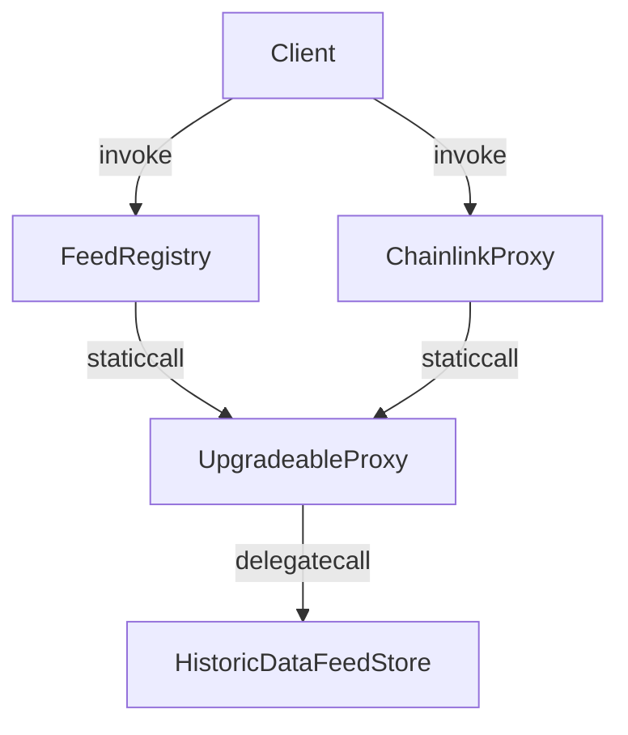

# Data Feed Storage

## Overview

The `contracts` folder has the following structure:

```text
contracts
├── chainlink-proxies
│   ├── registries
│   │   └── FeedRegistry.sol
│   └── ChainlinkProxy.sol
├── interfaces
│   ├── IAggregator.sol
│   ├── IChainlinkAggregator.sol
│   └── IFeedRegistry.sol
├── libraries
│   └── ProxyCall.sol
├── test
│   ├── consumers
│   │   ├── historic
│   │   │   └── ...
│   │   └── ...
│   ├── interfaces
│   │   └── ...
│   ├── DataFeedStoreGeneric.sol
│   ├── DataFeedStoreGenericV1.sol
│   ├── DataFeedStoreGenericV2.sol
│   └── HistoricDataFeedStoreGenericV1.sol
├── DataFeedStoreV1.sol
├── DataFeedStoreV2.sol
├── DataFeedStoreV3.sol
├── HistoricDataFeedStoreV1.sol
├── HistoricDataFeedStoreV2.sol
└── UpgradeableProxy.sol
```

The `chainlink-proxies` folder contains the Chainlink proxy contract - ChainlinkProxy.sol. The Chainlink proxy contract implements the Chainlink aggregator interface. It interacts with the UpgradeabilityProxy contract to make calls to the data feed store contracts. The `registries` folder contains the FeedRegistry contract which is used to register new data feeds. It stores the immutable data from Chainlink proxy contracts (key, description and decimals) and directly calls the upgradeable historic data feed contract to retrieve data.

The `interfaces` folder contains the interfaces for the Chainlink aggregator contract - IChainlinkAggregator.sol, the data feed store contract - IFeedRegistry.sol and the modified aggregator contract which extends the functionality of IChainlinkAggregator.sol - IAggregator.sol.

The `libraries` folder contains the ProxyCall library which is used to make calls to either the data feed store contracts or the UpgradeableProxy before them. The ProxyCall library is used by the Chainlink proxy contracts and the FeedRegistry contracts.

The `test` folder contains example consumer contracts (under `consumers`) and reference implementations of data feed store - DataFeedStoreGenericV1.sol, DataFeedStoreGenericV2.sol and HistoricDataFeedStoreGenericV1.sol.

Each of the data feed store implementations (DataFeedStoreV1.sol, DataFeedStoreV2.sol, DataFeedStoreV3.sol) is a contract that stores data feed values for a specific data feed key. The data feed key is a maximum of 31 bit integer that uniquely identifies a data feed. The data feed value is stored as `bytes32`. The data feed value is updated by the data feed store contract owner.

The historic data feed contracts (HistoricDataFeedStoreV1.sol, HistoricDataFeedStoreV2.sol) store historic data feed values for a specific data feed key. The data feed key is a maximum of 29 bit integer that uniquely identifies a data feed. The data feed value is stored as packed `bytes32` which consists of `bytes24 value` and `uint64 timestamp`. When a new value is set, a counter representing the contiguous history of the stored values is incremented. The data feed value is updated by the data feed store contract owner.



### Calls

All calls are handled by a fallback function based on the selector:

- Setter:
  - All contracts have the same selector `0x1a2d80ac` which is the keccak256 hash of the string `setFeeds(bytes)`.

#### DataFeedStore

- Getter:
  - For `DataFeedStoreV1.sol` the selector is `0x00000000` + a key which should not be greater than a predefined constant `CONTRACT_MANAGEMENT_SELECTOR` (e.g. `0x00...0001ffff`);
  - For `DataFeedStoreV2.sol` and `DataFeedStoreV3.sol` the selector is `0x80000000` + key which enables the key to be a 31 bit integer. The most significant bit of the selector defines the type of the call (getter or setter).

#### HistoricDataFeedStore

- Getter:
  - There are 3 types of selectors:
    - `0x80000000` + key which returns the most recent value based on the latest counter from the feed with id `key`;
    - `0x40000000` + key which returns the latest counter for the feed with id `key`;
    - `0x20000000` + key followed by counter which returns the value at `counter` for the feed with id `key`;
    - `0xc0000000` + key to call both `0x40000000` and `0x80000000` selectors in a single call.

> This way the gas cost of calls is reduced as the Solidity compiler will not generate `Linear If-Else Dispatcher` statements for the different selectors.

### Storage layout representation

- `DataFeedStoreV1.sol` and `DataFeedStoreV2.sol`:
  - `mapping(uint32 key => bytes32 value) dataFeed`
- `DataFeedStoreV3.sol`:
  - `bytes32[] dataFeed`
- `HistoricDataFeedStoreV1.sol`:
  - array[key] -> array[counter] -> Transmission { value, timestamp }
- `HistoricDataFeedStoreV2.sol`:
  - `mapping(uint32 key => mapping(uint256 counter => Transmission { value, timestamp })) dataFeed`
  - `uint256[] latestCounters`

## Development

Available scripts:

```sh
yarn hardhat help # Display Hardhat commands
yarn clean # Clean all untracked files
yarn build # Compile contracts
yarn test # Run tests
yarn test:fork # Run tests with forking enabled only for tests marked with `@fork` in the description
yarn coverage # Run tests and generate coverage report
yarn size # Display size of contracts

# Run these two in separate shells:
# Run a local node
yarn hardhat node
yarn deploy:local ./scripts/<script_name>.ts

# To fork Mainnet when running chainlink-event-fetcher.ts script:
FORKING=true yarn hardhat run ./scripts/chainlink-event-fetcher.ts

# To run tests with opcodes & gas tracing:
TRACE_TX=true yarn test
```

## Testing

To execute all tests (except `@fork`), simply run:

```sh
yarn test
```

To run `@fork` tests, run:

```sh
yarn test:fork
```

This command will output a gas cost comparison table between the different data feed store implementations and the reference implementations.

You can also run the tests and generate a coverage report by running:

```sh
yarn coverage
```
