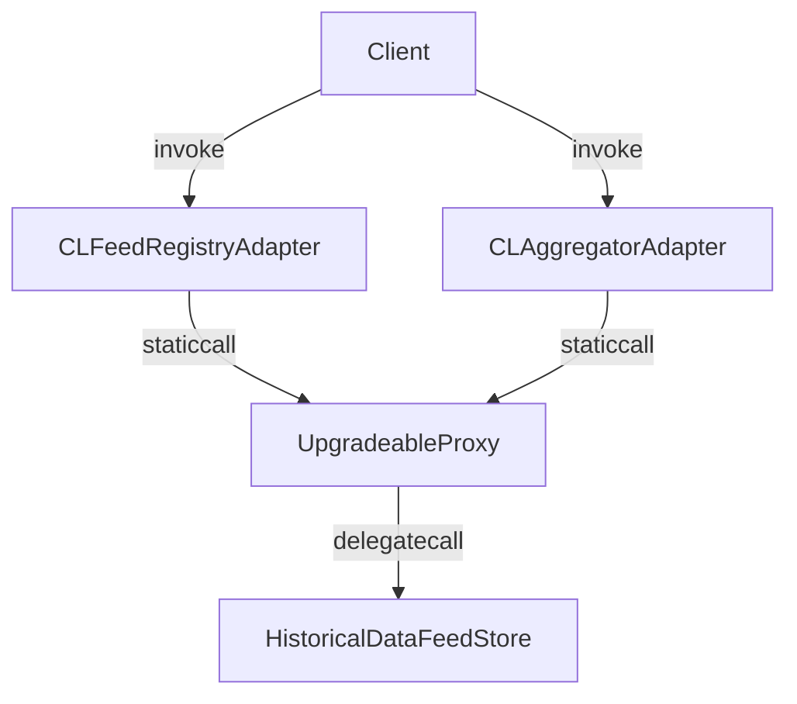

# Data Feed Storage

> [!IMPORTANT]
> The contracts listed here are deprecated and are used for testing purposes and/or gas comparison.

## Overview

The `contracts` folder has the following structure:

```text
contracts
└── experiments
    ├── cl-adapters
    │   ├── registries
    │   │   └── CLFeedRegistryAdapterExp.sol
    │   └── CLAggregatorAdapterExp.sol
    ├── interfaces
    │   ├── ICLAggregatorAdapterExp.sol
    │   └── ICLFeedRegistryAdapterExp.sol
    ├── libraries
    │   └── BlocksenseExp.sol
    ├── DataFeedStoreV1.sol
    ├── DataFeedStoreV3.sol
    ├── DataFeedStoreV2.sol
    ├── HistoricalDataFeedStoreV1.sol
    ├── HistoricalDataFeedStoreV2.sol
    └── UpgradeableProxy.sol
```

The `cl-adapters` folder contains the Chainlink aggregator contract - CLAggregatorAdapterExp.sol. The Chainlink aggregator contract implements the Chainlink aggregator interface. It interacts with the UpgradeableProxy contract to make calls to the data feed store contracts. The `registries` folder contains the CLFeedRegistryAdapter contract which is used to register new data feeds. It stores the immutable data from Chainlink aggregator contracts (key, description and decimals) and directly calls the upgradeable historical data feed contract to retrieve data.

The `interfaces` folder contains the interfaces for the data feed store contract - ICLFeedRegistryAdapterExp.sol and the modified aggregator contract which extends the functionality of IChainlinkAggregatorExp.sol - ICLAggregatorAdapterExp.sol.

The `libraries` folder contains the Blocksense library which is used to make calls to either the data feed store contracts or the UpgradeableProxy before them. The Blocksense library is used by the Chainlink aggregator contracts and the CLFeedRegistryAdapter contracts.

Each of the data feed store implementations (DataFeedStoreV1.sol, DataFeedStoreV2.sol, DataFeedStoreV3.sol) is a contract that stores data feed values for a specific data feed key. The data feed key is a maximum of 31 bit integer that uniquely identifies a data feed. The data feed value is stored as `bytes32`. The data feed value is updated by the data feed store contract owner.

The historical data feed contracts (HistoricalDataFeedStoreV1.sol, HistoricalDataFeedStoreV2.sol) store historical data feed values for a specific data feed key. The data feed key is a maximum of 29 bit integer that uniquely identifies a data feed. The data feed value is stored as packed `bytes32` which consists of `bytes24 value` and `uint64 timestamp`. When a new value is set, a counter representing the contiguous history of the stored values is incremented. The data feed value is updated by the data feed store contract owner.



### Calls

All calls are handled by a fallback function based on the selector:

- Setter:
  - All contracts have the same selector `0x1a2d80ac` which is the keccak256 hash of the string `setFeeds(bytes)`.

#### DataFeedStore

- Getter:
  - For `DataFeedStoreV1.sol` the selector is `0x00000000` + a key which should not be greater than a predefined constant `CONTRACT_MANAGEMENT_SELECTOR` (e.g. `0x00...0001ffff`);
  - For `DataFeedStoreV2.sol` and `DataFeedStoreV3.sol` the selector is `0x80000000` + key which enables the key to be a 31 bit integer. The most significant bit of the selector defines the type of the call (getter or setter).

#### HistoricalDataFeedStore

- Getter:
  - There are 3 types of selectors:
    - `0x80000000` + key which returns the most recent value based on the latest counter from the feed with id `key`;
    - `0x40000000` + key which returns the latest counter for the feed with id `key`;
    - `0x20000000` + key followed by counter which returns the value at `counter` for the feed with id `key`;
    - `0xc0000000` + key to call both `0x40000000` and `0x80000000` selectors in a single call.

> This way the gas cost of calls is reduced as the Solidity compiler will not generate `Linear If-Else Dispatcher` statements for the different selectors.

### Storage layout representation

- `DataFeedStoreV1.sol` and `DataFeedStoreV2.sol`:
  - `mapping(uint32 key => bytes32 value) dataFeed`
- `DataFeedStoreV3.sol`:
  - `bytes32[] dataFeed`
- `HistoricalDataFeedStoreV1.sol`:
  - array[key] -> array[counter] -> Transmission { value, timestamp }
- `HistoricalDataFeedStoreV2.sol`:
  - `mapping(uint32 key => mapping(uint256 counter => Transmission { value, timestamp })) dataFeed`
  - `uint256[] latestCounters`

## Testing

To execute all tests (except `@fork`), simply run:

```sh
yarn test test/experiments/**.ts
```

To run `@fork` tests, run:

```sh
yarn test:fork
```

This command will output a gas cost comparison table between the different data feed store implementations and the reference implementations.

You can also run the tests and generate a coverage report by running:

```sh
yarn coverage
```

## Examples

Example contracts on how to consume data from Blocksense contracts can be found in `contracts/test/experiments/examples`.
Ethers examples on how to read data from Blocksense contracts can be found in `test/experiments/examples/utils`.

## Documentation generation

We use [@blocksense/sol-reflector](../../libs/sol-reflector/README.md) - a tool designed to enhance the documentation extraction process for Solidity smart contracts.

To generate the documentation for the smart contracts, run:

```sh
yarn sol-reflect
```

The documentation will be generated in the `artifacts/docs` folder.
