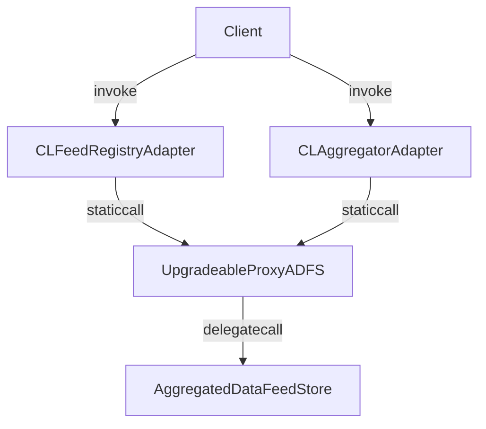

# Data Feed Storage

## Overview

The `contracts` folder has the following structure:

```text
contracts
├── cl-adapters
│   ├── registries
│   │   └── CLFeedRegistryAdapter.sol
│   └── CLAggregatorAdapter.sol
├── interfaces
│   ├── chainlink
│   │   ├── IChainlinkAggregator.sol
│   │   └── IChainlinkFeedRegistry.sol
│   ├── ICLAggregatorAdapter.sol
│   ├── ICLFeedRegistryAdapter.sol
│   └── IUpgradeableProxy.sol
├── libraries
│   ├── Blocksense.sol
│   └── CLAdapterLib.sol
├── safe
│   └── OnlySequencerGuard.sol
├── test
│   ├── chainlink-oracles
│   │   ├── Oracle.sol
│   │   └── Registry.sol
│   ├── examples
│   │   └── ...
│   └── AggregatedDataFeedStoreGeneric.sol
├── AccessControl.sol
├── AggregatedDataFeedStore.sol (ADFS)
└── UpgradeableProxyADFS.sol
```

The `cl-adapters` folder contains the Chainlink aggregator contract - CLAggregatorAdapter.sol. The Chainlink aggregator contract implements the Chainlink aggregator interface. It interacts with the UpgradeableProxyADFS contract to make calls to the data feed store contracts. The `registries` folder contains the CLFeedRegistryAdapter contract which is used to register new data feeds. It stores the immutable data from CL aggregator adapter contracts (id, description and decimals) and directly calls the upgradeable ADFS contract to retrieve data.

The `interfaces` folder contains the interfaces for the Chainlink aggregator contract - IChainlinkAggregator.sol, the data feed store contract - ICLFeedRegistryAdapter.sol, the modified aggregator contract which extends the functionality of IChainlinkAggregator.sol - ICLAggregatorAdapter.sol and the interface for the upgradeable proxy contract - IUpgradeableProxy.sol.

The `libraries` folder contains the Blocksense library which is used to make calls to the upgradeable ADFS proxy. The CLAdapterLib is used by the Chainlink aggregator contracts and the CLFeedRegistryAdapter contract.

The `safe` folder contains the OnlySequencerGuard contract which is used to restrict access when writing data to the ADFS contract.

The `test` folder contains example consumer contracts (under `consumers`) and a reference implementation of ADFS - AggregatedDataFeedStoreGeneric.sol. It also contains the `chainlink-oracle` contracts which are used for gas comparison tests against Chainlink.

The `AccessControl.sol` contract is used to manage access control when writing data to the ADFS contract.

The `AggregatedDataFeedStore.sol` contract (ADFS) is where data is stored and read from. The `UpgradeableProxyADFS.sol` contract is used as a transparent proxy for the ADFS contract.



### Calls

All read calls must start with the first bit set to 1, where the whole selector is 1 byte (0x80 in binary is 0b10000000, i.e. first bit set to 1):

- Setter:
  - `0x00`
- Getters:
  - `0x86`: getFeedAtRound(uint8 stride, uint120 feedId, uint16 round, uint32 startSlot?, uint32 slots?) returns (bytes)
  - `0x81`: getLatestRound(uint8 stride, uint120 feedId) returns (uint16)
  - `0x82`: getLatestSingleData(uint8 stride, uint120 feedId) returns (bytes)
  - `0x84`: getLatestData(uint8 stride, uint120 feedId, uint32 startSlot?, uint32 slots?) returns (bytes)
  - `0x83` will call both **getLatestRound** and **getLatestSingleData**.
  - `0x85` will call both **getLatestRound** and **getLatestData**.

### Storage layout representation

The slots between 0 and 2\*\*128-2\*\*116 - 1 are considered management slots. These values are used for admin functionality.
The slots between 2\*\*128-2\*\*116 and 2\*\*128 - 1 are considered Round table slots. These values are used to store the latest round of a feed. Each slot consists of 16 packed rounds (2 bytes each).
The slots between 2\*\*128 and 2\*\*160 - 1 are considered Data feed slots. Here all data feeds are stored along with their historical data. Data feeds are of different slot sizes based on the stride (powers of 2). For example, stride 0 is 32b (1 slot) data, stride 1 is 64b, stride 2 is 128b and so on. Data feeds have historical data stored up to 8192 rounds. CL-compatible contracts make use of only stride 0 data feeds. There are 32 strides in total (stride 0 to stride 31) which leaves us with 2\*\*115 feed IDs in each stride (2\*\*115 \* 32 feed IDs combined).

### Events

When an update is posted to the contract, an event is emitted - “DataFeedsUpdated(uint256 blockNumber)” (topic: 0xe64378c8d8a289137204264780c7669f3860a703795c6f0574d925d473a4a2a7). Block number is an internal counter for the Blocksense system. Through this event off-chain programs can subscribe to is and trigger on-chain actions when needed.

## Development

Available scripts:

```sh
yarn hardhat help # Display Hardhat commands
yarn clean # Clean all untracked files
yarn build:deps # Build workspace dependencies
yarn build # Compile contracts
yarn sol-reflect # Generate smart contracts's documentation
yarn test # Run tests
yarn test:fork # Run tests with forking enabled only for tests marked with `@fork` in the description
yarn coverage # Run tests and generate coverage report
yarn size # Display size of contracts

# Run these two in separate shells:
# Run a local node
yarn hardhat node
yarn deploy:local ./scripts/<script_name>.ts

# To fork Mainnet when running chainlink-event-fetcher.ts script:
FORKING=true yarn hardhat run ./scripts/chainlink-event-fetcher.ts

# To run tests with opcodes & gas tracing:
TRACE_TX=true yarn test
```

## Testing

To execute all tests (except `@fork`), simply run:

```sh
yarn test
```

To run `@fork` tests, run:

```sh
yarn test:fork
```

This command will output a gas cost comparison table between the different data feed store implementations and the reference implementations.

You can also run the tests and generate a coverage report by running:

```sh
yarn coverage
```

## Examples

Example contracts on how to consume data from Blocksense contracts can be found in `contracts/test/examples`.
Ethers examples on how to read data from Blocksense contracts can be found in `test/examples/utils`.

## Documentation generation

We use [@blocksense/sol-reflector](../../libs/sol-reflector/README.md) - a tool designed to enhance the documentation extraction process for Solidity smart contracts.

To generate the documentation for the smart contracts, run:

```sh
yarn sol-reflect
```

The documentation will be generated in the `artifacts/docs` folder.

## License

See the [LICENSE](LICENSE.md) file for license rights and limitations (MIT).
